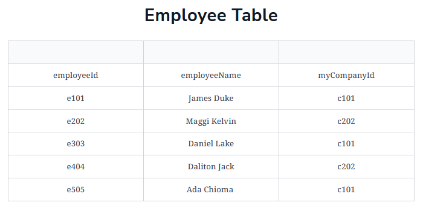

# Overview of ORMs

* [Prisma](./Prisma.md)
    * [Project Prisma-ed](./prisma-ed/README.md)

# Overview of SQL relationships
## One-to-one
In SQL, a one-to-one relationship is the relationship that exists between records of two tables where one record maps to another one uniquely. A one-to-one is a lot like a relationship that exists between an employee and the employee’s office—one in which a company assigns only a single office per employee.

## Many-to-one
A many-to-one or a one-to-many relationship is a relationship in which one record in an SQL table maps to many other records in a different table. A good illustration of this is the relationship that exists between the company and its employees. Many people (the employees) can belong to one company, and one company can have many employees.

To achieve this in the SQL, a foreign key column is added to either of the tables that map to the primary key of the other table.

Below we have two separate tables for the company and employees:



## Many-to-many

A many-to-many relationship is a relationship in which many records in a table map or point to many records in another table. A good illustration of this is the relationship that exists between skill sets and employees. An employee can have many skill sets, and many skill sets (like communication, programming, or leadership) can belong to an employee.

To achieve this in SQL, we use a **join table** with **two foreign keys** pointing to the primary keys of the two tables (in our case, skills and employee tables).

# Sql Queries

```sql
SELECT * FROM Employers;
```

```sql
UPDATE Employers SET state='Imo' WHERE name='Henry';
```

```sql
UPDATE Employers SET state='Imo' WHERE name='Henry';
```

# ORMs
## Some of their core benefits are:

- [x] `Unified codebases:` With an ORM, the development language doesn’t change to interact with the database since the **ORM provides database abstraction.** We only write code in our preferred language, and the ORM handles the interaction with the SQL database.
- [x] `Advanced features:` ORMs provide advanced SQL features that may be difficult to implement directly or may require a lot of expertise, but also greatly improve the functionality of the database. Some of those features include connection **pooling, migrations, database seeding, and transactions.**
- [x] `Security:` ORMs provide security against some of the major threats when working with SQL databases (for example, SQL injection). That’s because they filter each instruction or query. They also present a **strict and properly engineered structure** when interacting with the database.
- [x] `Flexibility:` There are many different SQL databases out there with some **differences in query syntax** such as MySQL, Postgres, MSSSQL, and so on. An ORM gives developers leverage because they don’t have to learn the query syntaxes for these databases. We just write code only in our preferred language, and it handles all the database interaction.

## Commonly supported ORMs
A few ORMs with excellent support for TypeScript are:

- [x] Prisma
- [x] TypeORM
- [x] Bookshelf.js
- [x] Mongoose
- [x] Sequelize
- [x] Waterline
- [x] MikroORM

### Prisma

Prisma is a relatively new library but is very popular and stable with significant community contributions. With Prisma, we can easily add records to a table in the form of simple JavaScript objects.

```ts
let user = await prisma.users.create({
  firstName: "John Doe",
  title: "Web engineer",
  age: 22
})
```

Prisma provides a unique declarative way of building models for our entities or tables that’s very friendly and human-readable.

```ts
model @Post {
  id Int @id default(autoincrement())
  title String
  content String
  summary String?
}
```

#### TypeORM

TypeORM is one of the best choices for TypeScript developers since it provides support for the latest features of JavaScript, like the class decorators. We can easily build models using regular classes and decorators.

```ts
import { Entity, PrimaryGeneratedColumn, Column } from "typeorm";

@Entity('teacher')
export class Teacher {

    @PrimaryGeneratedColumn()
    id: number;

    @Column({type: "varchar"})
    firstName: string;

    @Column({type: "varchar"})
    lastName: string;

    @Column({type: "varchar"})
    className: string;

}
```

### Models

Models refer to our SQL tables. In SQL, every column has a column name, data type, and other optional attributes, while a row has the data that populates the columns.

Using TypeORM, we can define a model (SQL table), as follows:

### Entity

Entities are the same as models. They describe what our table will look like. **In Prisma, our SQL table is called model. In TypeORM, it’s called “entity,”** but is structured the same way as SQL tables.

### Query

Query is a familiar word to database admins and back-end engineers. It means actions or instructions carried out on a database that either read, create, delete, or update a record.

Queries across different ORMs are very similar, and they are usually built-in functions with well-defined function names that accept some arguments, usually in the form of objects.

```ts
const foundCompany = await this.companyRepo.findOne({
where: { company_email: data.company_email },
    });
```

### Relationship

Relationships are important when working with relational database management systems. They define how different tables (entities or models) are interconnected.
Let’s see how a **many-to-one relationship** between a Player table and a Club table is defined.

```ts
import { Entity, PrimaryGeneratedColumn, Column, OneToMany, Exclude, ManyToOne, JoinColumn} from "typeorm";

@Entity('player')
export class Player {

    @PrimaryGeneratedColumn()
    id: number;

    @Column({type: "varchar"})
    fullName: string;

    @Exclude()
    @ManyToOne(() => Club, (club) => club.players)
    @JoinColumn()
    club: Club;
 }

@Entity('club')
export class Club {

    @PrimaryGeneratedColumn()
    id: number;

    @Column({type: "varchar"})
    name: string;

    @OneToMany(() => Player, (player) => player.club)
    players: Player[];
 }
```

### Migration

For most ORMs, migration is a way to update the database, similar to a version control schema. Any time we update a schema and run a migration, the ORM updates the existing table with the respective columns and rows, as we’ve declared on the schema we updated.

### Seeding

Seeding means populating our database with some **initial set of data**. This is useful in testing.

### Synchronization

Synchronization is implemented in different ways by ORMs. But generally, it deals with how our schema will be mapped to the database.
In some ORMs, **setting the sync feature to true may wipe (drop or truncate) the entire database while false will just update what needs to be updated.**
